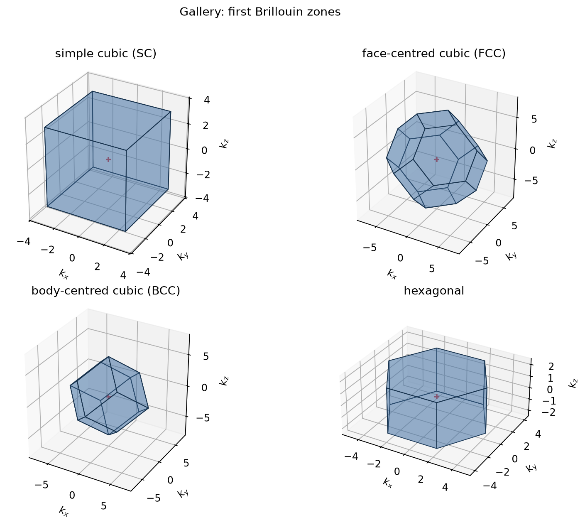

# Brillouin-zone toolkit

`brillouin-zone-toolkit` is a small, dependency-light Python implementation of the
reciprocal-lattice and first-Brillouin-zone construction used in solid-state physics.
It works with primitive vectors written as rows and uses the convention

\[
  \mathbf a_i\cdot\mathbf b_j = 2\pi\delta_{ij}.
\]

The package builds the Wigner--Seitz cell of the reciprocal lattice from half-spaces,
enumerates its vertices/faces/edges, samples points inside it, and applies point-group
operations to reduce equivalent points.  Ready-made constructors cover simple cubic (SC),
face-centred cubic (FCC), body-centred cubic (BCC), and hexagonal lattices.



The gallery above is generated by `scripts/reproduce.py`; it is not a screenshot copied from
the academic report.

## Geometry checks from this checkout

The four built-in examples produce the expected convex-polyhedron topologies and satisfy
`zone.volume == lattice.reciprocal_volume` to floating-point precision:

| direct lattice | first-zone shape | vertices | faces |
| --- | --- | ---: | ---: |
| SC | cube | 8 | 6 |
| FCC | truncated octahedron | 24 | 14 |
| BCC | rhombic dodecahedron | 14 | 12 |
| hexagonal | hexagonal prism | 12 | 8 |

## Scope and provenance

This checkout is a modern reconstruction based on the methods and results described in the
undergraduate report originally supplied as `../BrilloinZones_IC.pdf` in the local archive. The
report is intentionally not mirrored in this public repository until redistribution rights are
confirmed. The report's historical Fortran/Mathematica source code is not included here. The Python implementation,
tests, and figures are new code and are **not** claimed to be the original implementation or a
bit-for-bit reproduction.  The PDF is documentary source material; its copyright and
redistribution terms remain separate from this repository's code license.

### Resumo (PT-BR)

Este projeto é uma reconstrução moderna, em Python, dos métodos descritos no relatório de
iniciação científica de 2021. Ele calcula a rede recíproca, constrói a primeira zona de
Brillouin como a célula de Wigner--Seitz, discretiza pontos e reduz pontos equivalentes pelas
simetrias de redes SC, FCC, BCC e hexagonal. O código e os gráficos são uma implementação nova
baseada no PDF, não uma cópia histórica do programa original.

## Installation and quickstart

Python 3.9 or newer is supported. For development (including plotting and tests):

```bash
python -m venv .venv
. .venv/bin/activate
python -m pip install -e '.[dev]'
python -m unittest discover -s tests -v
python scripts/reproduce.py
```

The reproduction script writes PNG figures and `summary.json` to `docs/figures/` by default.
Use `python scripts/reproduce.py --output /tmp/brillouin-figures` to choose another directory.
Matplotlib is optional for the numerical API and required only for plots/reproduction.

The generated files include one plot per lattice, the gallery shown above, and an FCC
symmetry-reduction visualization. Re-run the command whenever the numerical code changes so
the README image remains source-backed.

## Minimal example

```python
from brillouin_zone_toolkit import fcc, first_brillouin_zone

lattice = fcc(a=1.0)
zone = first_brillouin_zone(lattice)
print(zone.n_vertices, zone.n_faces, zone.volume)
```

For an FCC direct lattice this prints a truncated-octahedron topology (24 vertices and 14
faces), and its volume agrees with the reciprocal primitive-cell volume.

## Repository layout

```text
src/brillouin_zone_toolkit/   numerical API and optional plotting helpers
tests/                        regression tests for SC/FCC/BCC/hexagonal cases
scripts/reproduce.py          deterministic figure and JSON generation
docs/figures/                 generated figures and summary.json
```

## API notes

`Lattice.vectors` stores direct primitive vectors as rows. `reciprocal_vectors(A)` returns
reciprocal primitive vectors as rows. `first_brillouin_zone(lattice, search=2)` accepts either a
`Lattice` (direct basis) or a `(3, 3)` reciprocal basis array. The search radius is an integer
coefficient radius; increase it for unusually anisotropic custom cells.

## Citation and license

Metadata for citing this reconstruction is in [`CITATION.cff`](CITATION.cff). Original code and
documentation are released under the MIT License; see [`LICENSE`](LICENSE). The report remains
in the local archive and should be cited separately as the original academic work.

## Validation and limitations

The test suite checks reciprocal duality, primitive-cell and Brillouin-zone volumes, the
SC/FCC/BCC/hexagonal combinatorics, half-space containment, deterministic sampling, and
symmetry orbits. The geometric search is finite: `search=2` covers the bundled examples, while
highly anisotropic custom cells may need a larger radius. The point-group helper is deliberately
conservative for custom bases and is not a full crystallographic space-group database.

This project reconstructs the method from the report. It does not contain the missing historical
Fortran, Mathematica, or Gnuplot files, and it does not copy the JavaScript implementation cited
as inspiration in the report.
